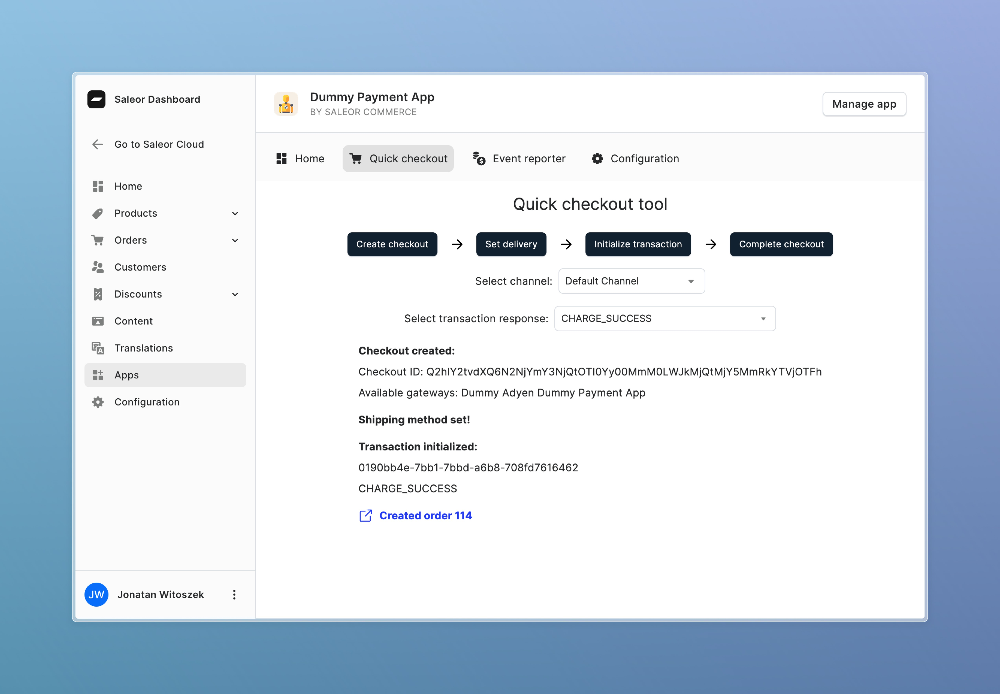
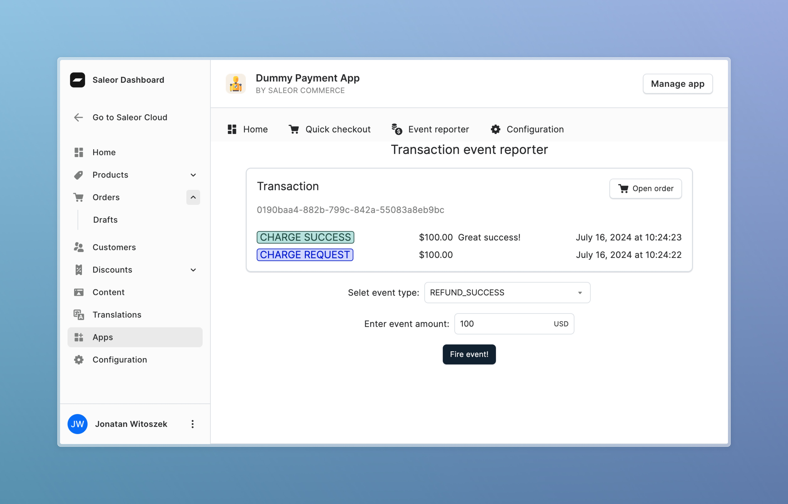

<div align="center">

</div>

<div align="center">
  <h1>Dummy Payment App</h1>
</div>

<div align="center">
  <p>Bare-bones app for testing Saleor's <a href="https://docs.saleor.io/docs/developer/payments#payment-app">Transactions API</a></p>
</div>

<div align="center">
  <a href="https://saleor.io/">Website</a>
  <span> | </span>
  <a href="https://docs.saleor.io/docs/3.x/">Docs</a>
</div>

### What is Dummy Payment App?

The Dummy Payment App allows you to test Saleor's payment and checkout features without needing to set up a real payment provider. You can create orders, process payments, issue refunds, and more, all within the Saleor Dashboard.

### App features

- Create new checkouts from Saleor Dashboard and create orders:



- Process payments and update transaction statuses:



> ![TIP]
> Each Transaction has `externalUrl` that links to this page from Order tails page in Saleor Dashboard:

- Issue refunds, process charges and cancellations for Transactions

### How does it work?

The Dummy Payment App supports the following webhooks to enable payment flows:

It implements webhooks to process payments initiated from your storefront:

- `PAYMENT_GATEWAY_INITIALIZE_SESSION`
- `TRANSACTION_INITIALIZE_SESSION`
- `TRANSACTION_PROCESS_SESSION`

It also implements webhooks to allow updating the status of Transactions from the Saleor Dashboard, similar to how a real third-party payment provider would:

- `TRANSACTION_REFUND_REQUESTED`
- `TRANSACTION_CHARGE_REQUESTED`
- `TRANSACTION_CANCELATION_REQUESTED`

### Learn more

#### Docs

- [**Apps guide**](https://docs.saleor.io/docs/developer/extending/apps/overview) - learn more how to build your own Saleor app
- [**Transactions API**](https://docs.saleor.io/docs/developer/payments) - learn how to use Transactions API in your store
- [**Payment App webhooks**](https://docs.saleor.io/docs/developer/extending/webhooks/synchronous-events/transaction) - learn how to build your own Payment App

#### Examples

- [**Stripe Payment App**](https://github.com/saleor/saleor-app-payment-stripe)
- [**Stripe Example Storefront**](https://github.com/saleor/example-nextjs-stripe)

## Development

### Requirements

Before you start, make sure you have installed:

- [Node.js](https://nodejs.org/en/)
- [pnpm](https://pnpm.io/)
- [Saleor CLI](https://docs.saleor.io/docs/3.x/cli) - optional, but recommended

### With CLI

The easiest way to set up a Saleor app is by using the Saleor CLI.

[Saleor CLI](https://github.com/saleor/saleor-cli) is designed to save you from the repetitive chores around Saleor development, including creating Apps. It will take the burden of spawning new apps locally, connecting them with Saleor environments, and establishing a tunnel for local development in seconds.

[Full Saleor CLI reference](https://docs.saleor.io/docs/3.x/cli)

If you don't have a (free developer) Saleor Cloud account, create one with the following command:

```
saleor register
```

You will also have to login with:

```
saleor login
```

Now you're ready to create your first App:

```
saleor app template [your-app-name]
```

In this step, Saleor CLI will:

- clone this repository to the specified folder
- install dependencies
- ask you whether you'd like to install the app in the selected Saleor environment
- create `.env` file
- start the app in development mode

Having your app ready, the final thing you want to establish is a tunnel with your Saleor environment. Go to your app's directory first and run:

```
saleor app tunnel
```

Your local application should be available now to the outside world (Saleor instance) for accepting all the events via webhooks.

A quick note: the next time you come back to your project, it is enough to launch your app in a standard way (and then launch your tunnel as described earlier):

```
pnpm dev
```

### Without CLI

1. Install the dependencies by running:

```
pnpm install
```

2. Start the local server with:

```
pnpm dev
```

3. Expose local environment using tunnel:
   Use tunneling tools like [localtunnel](https://github.com/localtunnel/localtunnel) or [ngrok](https://ngrok.com/).

4. Install the application in your dashboard:

If you use Saleor Cloud or your local server is exposed, you can install your app by following this link:

```
[YOUR_SALEOR_DASHBOARD_URL]/apps/install?manifestUrl=[YOUR_APP_TUNNEL_MANIFEST_URL]
```

This template host manifest at `/api/manifest`

You can also install application using GQL or command line. Follow the guide [how to install your app](https://docs.saleor.io/docs/3.x/developer/extending/apps/installing-apps#installation-using-graphql-api) to learn more.

### Generated schema and typings

Commands `build` and `dev` would generate schema and typed functions using Saleor's GraphQL endpoint. Commit the `generated` folder to your repo as they are necessary for queries and keeping track of the schema changes.

[Learn more](https://www.graphql-code-generator.com/) about GraphQL code generation.

### Storing registration data - APL

During the registration process, Saleor API passes the auth token to the app. With this token App can query Saleor API with privileged access (depending on requested permissions during the installation).
To store this data, app-template use a different [APL interfaces](https://github.com/saleor/saleor-app-sdk/blob/main/docs/apl.md).

The choice of the APL is made using the `APL` environment variable. If the value is not set, FileAPL is used. Available choices:

- `file`: no additional setup is required. Good choice for local development. It can't be used for multi tenant-apps or be deployed (not intended for production)
- `upstash`: use [Upstash](https://upstash.com/) Redis as storage method. Free account required. It can be used for development and production and supports multi-tenancy. Requires `UPSTASH_URL` and `UPSTASH_TOKEN` environment variables to be set

If you want to use your own database, you can implement your own APL. [Check the documentation to read more.](https://github.com/saleor/saleor-app-sdk/blob/main/docs/apl.md)

## Support

Please open GitHub issues if you find any problem with this app. PRs are welcome too 😄

You can find help with Saleor in these places:

- [GitHub Discussions](https://github.com/saleor/saleor/discussions)
- [Saleor Discord](https://discord.gg/H52JTZAtSH)

## Credits

- App logo: <a href="https://www.flaticon.com/free-icons/dummy" title="dummy icons">Dummy icons created by Flat Icons - Flaticon</a>
